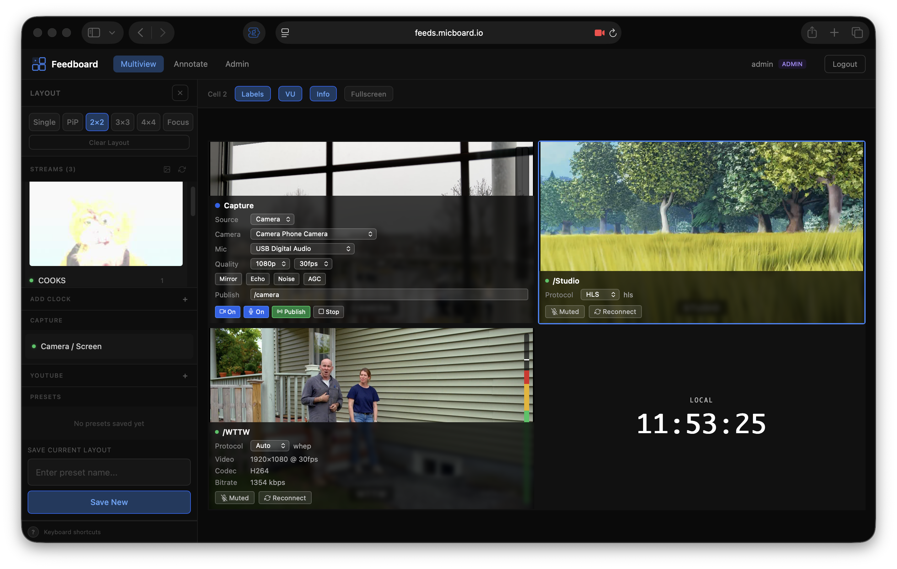
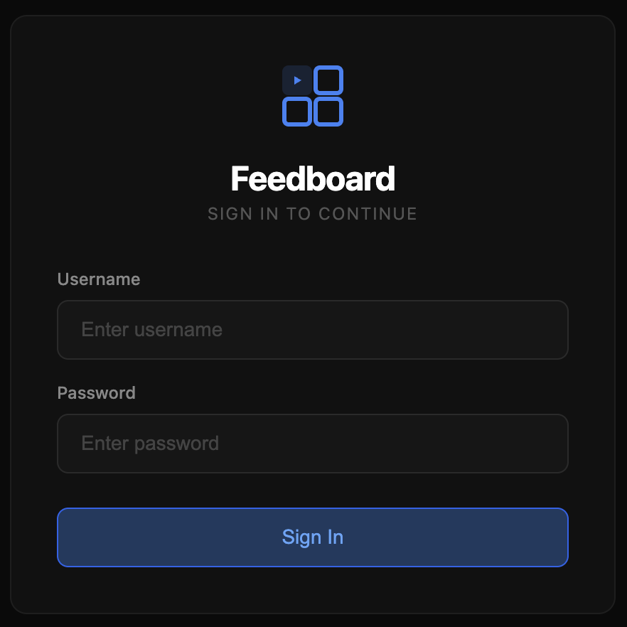
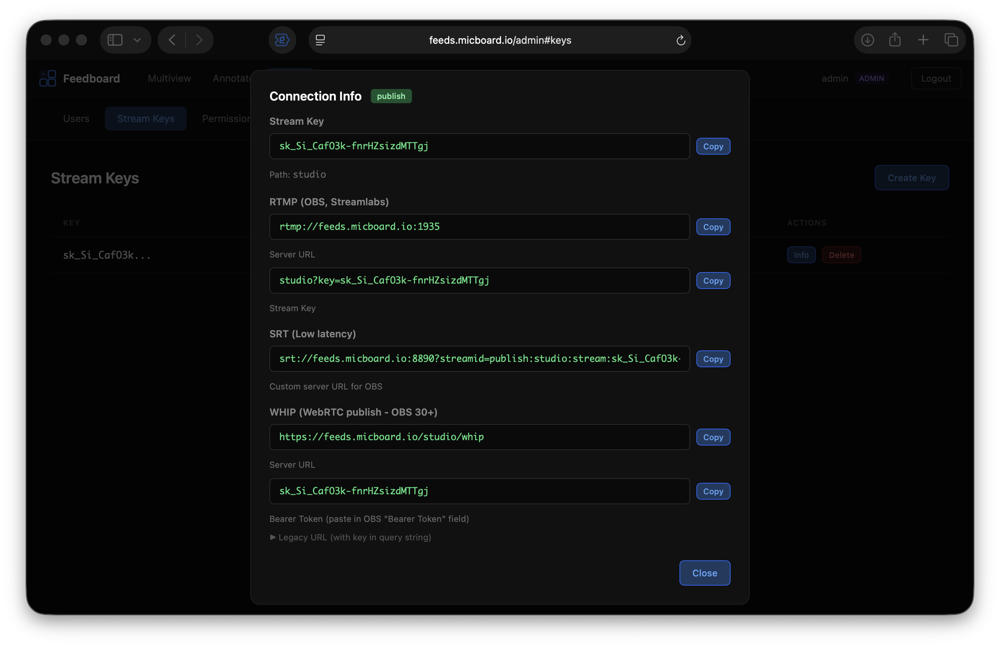

<p align="center">
  
</p>

# Feedboard


A browser-based video production toolkit for [MediaMTX](https://github.com/bluenviron/mediamtx). Create multiview layouts, capture local sources, and stream via WebRTC.


https://github.com/user-attachments/assets/423af763-8944-4604-acec-292109d9f5e1




 

## Features

- Multi-view grid layouts (1x1 to 4x4, plus custom layouts)
- WebRTC (WHEP) and HLS playback
- Local camera/screen/tab capture with WHIP publishing
- Real-time thumbnails via thumbnailer service
- User authentication with JWT tokens
- Stream keys for RTMP/SRT/webRTC ingress/egress
- VU meters and stream stats overlay
- Live annotation and drawing overlay
- Keyboard shortcuts for fast operation

## Prerequisites

- **Docker** with Docker Compose
- **Node.js 20+**
- **Caddy**

## Quick Start

### Docker

```bash
cp .env.template .env
docker compose -f docker-compose.dev.yml up

# Access at https://localhost
```

### Local Development

```bash
# Terminal 1: MediaMTX
./mediamtx

# Terminal 2: Vite dev server
npm install
npm run dev

# Terminal 3: Caddy reverse proxy
caddy run
```

Access via `https://localhost`

## Architecture

```
Browser → Caddy → Feedboard SPA
                → MediaMTX (streaming)
                → authproxy (Go) → SQLite  [optional]
                → thumbnailer (Go)         [optional]
```

| Service | Port | Description |
|---------|------|-------------|
| Caddy | 80, 443 | Reverse proxy, TLS |
| MediaMTX | 1935, 8189, 8554, 8888, 8889, 8890, 9997 | RTMP, WebRTC UDP, RTSP, HLS, WebRTC HTTP, SRT, API |
| authproxy | 8091 | Authentication, stream keys, MediaMTX auth hook |
| thumbnailer | 8090 | Live thumbnail generation via RTSP |

**authproxy** and **thumbnailer** are optional and can be used together, separately, or with just MediaMTX (no UI). Without authproxy, streams are unauthenticated. Without thumbnailer, sidebar previews show placeholders until a stream is selected.

## Production Deployment

```bash
cp .env.template .env
# Edit .env - see Configuration section for variables
docker compose up -d
```

### Portainer Deployment

Feedboard can be deployed as a Portainer stack directly from this repository, using Git-based builds (no external image registry needed).

**1. Create the stack**

In Portainer: **Stacks → Add stack → Build method: Repository**

| Field | Value |
|-------|-------|
| Repository URL | this repo's URL (your fork, if you customized anything) |
| Repository reference | `refs/heads/main` (or the branch with your changes) |
| Compose path | `docker-compose.portainer.yml` |

**2. Set environment variables**

Under the stack's **Environment variables** section (not a committed `.env` file):

| Variable | Required | Description |
|----------|----------|--------------|
| `JWT_SECRET` | **Yes** | Generate with `openssl rand -hex 32`. Deploy fails without it. |
| `ADMIN_PASSWORD` | No | Initial admin login, defaults to `admin` — change it after first login |
| `THUMBNAILER_TOKEN` | No | Service token, generate with `openssl rand -hex 32` |
| `INTERNAL_PUBLISH_TOKEN` | No | Service token for test-stream publishers |
| `DOMAIN` | No | Your domain for automatic Let's Encrypt HTTPS. Omit for a self-signed cert on `:443` |
| `CORS_ORIGINS` | No | Comma-separated allowed origins, only needed if the API is served from a different origin |

**3. Deploy**

Portainer builds `feedboard`, `authproxy`, and `thumbnailer` from their Dockerfiles in this repo, then starts the stack.

**Requirements & caveats:**

- The Portainer endpoint must be a **Linux Docker host** — the `mediamtx` service uses `network_mode: host` for WebRTC/RTMP/SRT performance, which Docker Desktop (Mac/Windows) doesn't support.
- If deploying behind a cloud firewall/security group, also open: TCP 1935 (RTMP), UDP 8189 (WebRTC), TCP 8554 (RTSP), UDP 8890 (SRT), in addition to 80/443.
- `mediamtx.yml` is tuned for LAN/low-latency use out of the box (see [Tuning `mediamtx.yml`](#tuning-mediamtxyml) below). If you're deploying to a cloud host with external clients, review that section too.

See `docker-compose.portainer.yml` for the full stack definition and inline notes.

#### Tuning `mediamtx.yml`

The bundled `mediamtx.yml` ships with a few adjustments on top of MediaMTX's defaults, aimed at a home/LAN deployment:

- **`authInternalUsers[0].ips`** includes `192.168.1.0/24` in addition to `127.0.0.1`/`::1`, so devices on that LAN can reach the MediaMTX API/metrics/pprof endpoints directly, without going through authproxy. If your LAN uses a different subnet, or you don't want unauthenticated API access beyond localhost, edit or remove this entry — anyone on the listed range can hit the API with no credentials.
- **`webrtcAdditionalHosts`** must list the server's actual LAN IP (a concrete address, not a CIDR range) for WebRTC ICE candidates to resolve correctly from other devices on the network. Replace the placeholder with your server's real IP, e.g. `webrtcAdditionalHosts: ['127.0.0.1', '192.168.1.50']`. For a cloud deployment, use the public IP instead (see [AWS EC2 / Cloud Deployment](#aws-ec2--cloud-deployment)).
- **`udpReadBufferSize`** is raised to 2MB (from the OS default) to reduce packet loss when multiple WebRTC/RTP streams share the same socket buffer.
- **`webrtcHandshakeTimeout`**, **`webrtcSTUNGatherTimeout`**, and **`sourceOnDemandCloseAfter`** are lowered from their defaults, since a LAN doesn't need NAT-traversal-grade timeouts — failures surface faster and idle on-demand sources free up sooner.
- **`recordPath`** uses an absolute path (`/recordings/...`) instead of a relative one, so recordings survive container recreation. Recording is disabled by default (`record: no`); if you enable it, mount a volume for the `mediamtx` service in your compose file:
  ```yaml
  mediamtx:
    volumes:
      - ./mediamtx.yml:/mediamtx.yml:ro
      - ./recordings:/recordings
  ```

### AWS EC2 / Cloud Deployment

For WebRTC to work from external clients, MediaMTX needs to advertise a public IP. Edit within `mediamtx.yml`:

```yaml
webrtcAdditionalHosts: [EC2_PUBLIC_IP]
```

Ensure the security group allows the following ports:
- TCP 80 (HTTP, for Let's Encrypt)
- TCP 443 (HTTPS)
- TCP 1935 (RTMP)
- UDP 8189 (WebRTC)
- TCP 8554 (RTSP, if needed)
- UDP 8890 (SRT)

## Configuration

### Environment Variables

| Variable | Description | Default |
|----------|-------------|---------|
| `JWT_SECRET` | Secret for JWT signing | Required |
| `THUMBNAILER_TOKEN` | Service account token | Optional |
| `DOMAIN` | Domain for Let's Encrypt | `:443` (self-signed) |
| `MTX_HOST` | MediaMTX hostname | `mediamtx` |

Generate secure secrets with: `openssl rand -hex 32`

## Usage

### Default Login

```
Username: admin
Password: admin
```

Click your username in the header to change your password.

### Admin Panel

Access `/admin` to manage:
- Users (create, edit roles)
- Stream keys (for OBS/encoders)

### Stream Keys

Generate stream keys in the admin panel. Use them with:

**RTMP:**
```
Server: rtmp://server:1935/
Stream Key: streampath?key=STREAM_KEY
```

**SRT:**
```
srt://server:8890?streamid=publish:streampath:stream:STREAM_KEY
```

### Components

```html
<!-- Full application -->
<feedboard-app></feedboard-app>

<!-- Video player -->
<feedboard-player src="/camera1"></feedboard-player>

<!-- Local capture with WHIP publish -->
<feedboard-capture type="camera" publish-to="/webcam"></feedboard-capture>

<!-- Clock -->
<feedboard-clock format="HH:mm:ss" timezone="America/New_York"></feedboard-clock>
```

### Standalone Component Examples

Demo pages showing components outside the main app:

```bash
./mediamtx                # Terminal 1
./dev/test-streams.sh     # Terminal 2
npm run dev               # Terminal 3

# Access examples at:
# http://localhost:5173/examples/components-demo.html
# http://localhost:5173/examples/clocks.html
```

Note: Some components require the MediaMTX API enabled to function.

### Keyboard Shortcuts

| Key | Action |
|-----|--------|
| `S` | Toggle sidebar |
| `1-9` | Select cell |
| `0` | Deselect |
| `L` | Toggle labels |
| `U` | Toggle VU meters |
| `I` | Toggle info overlay |
| `G` | Cycle grid layout |
| `F` | Toggle fullscreen |
| `Enter` | Fullscreen selected cell |
| `Escape` | Exit fullscreen/close sidebar |
| `Delete` | Clear selected cell |
| Arrow keys | Navigate cells |

## Component Attributes

### `<feedboard-player>`

| Attribute | Type | Default | Description |
|-----------|------|---------|-------------|
| `src` | string | required | Stream path or full URL |
| `server` | string | - | Override server URL |
| `protocol` | `auto\|whep\|hls` | `auto` | Force protocol |
| `muted` | boolean | `true` | Start muted (for autoplay) |
| `autoplay` | boolean | `true` | Auto-connect on load |
| `show-info` | boolean | `false` | Show info overlay |
| `show-label` | boolean | `false` | Show centered label |
| `show-vu` | boolean | `false` | Show VU meter (WHEP only) |

### `<feedboard-capture>`

| Attribute | Type | Default | Description |
|-----------|------|---------|-------------|
| `type` | `camera\|screen\|tab` | `camera` | Capture source |
| `publish-to` | string | - | WHIP publish path |
| `server` | string | - | Override server URL |
| `resolution` | `720p\|1080p\|4k` | `1080p` | Video resolution |

### `<feedboard-clock>`

| Attribute | Type | Default | Description |
|-----------|------|---------|-------------|
| `format` | string | `HH:mm:ss` | Time format |
| `timezone` | string | local | IANA timezone |
| `label` | string | - | Display label |

## Test Streams

Add test streams to MediaMTX for development:

```bash
./dev/test-streams.sh
```

### Loop MP4 File

Stream an MP4 file to RTMP (loops forever):

```bash
./dev/play-mp4.sh video.mp4 streamname

# With stream key
./dev/play-mp4.sh video.mp4 "mystream?key=STREAM_KEY"

# To remote server
RTMP_SERVER=rtmp://server:1935 ./dev/play-mp4.sh video.mp4 demo
```

## License

MIT
